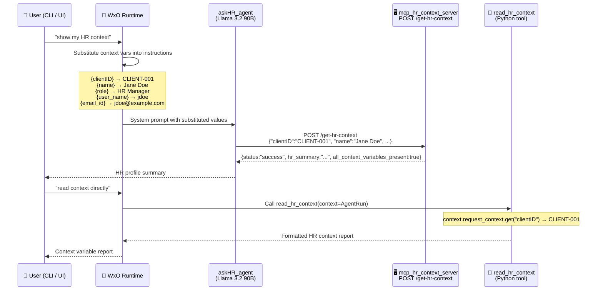
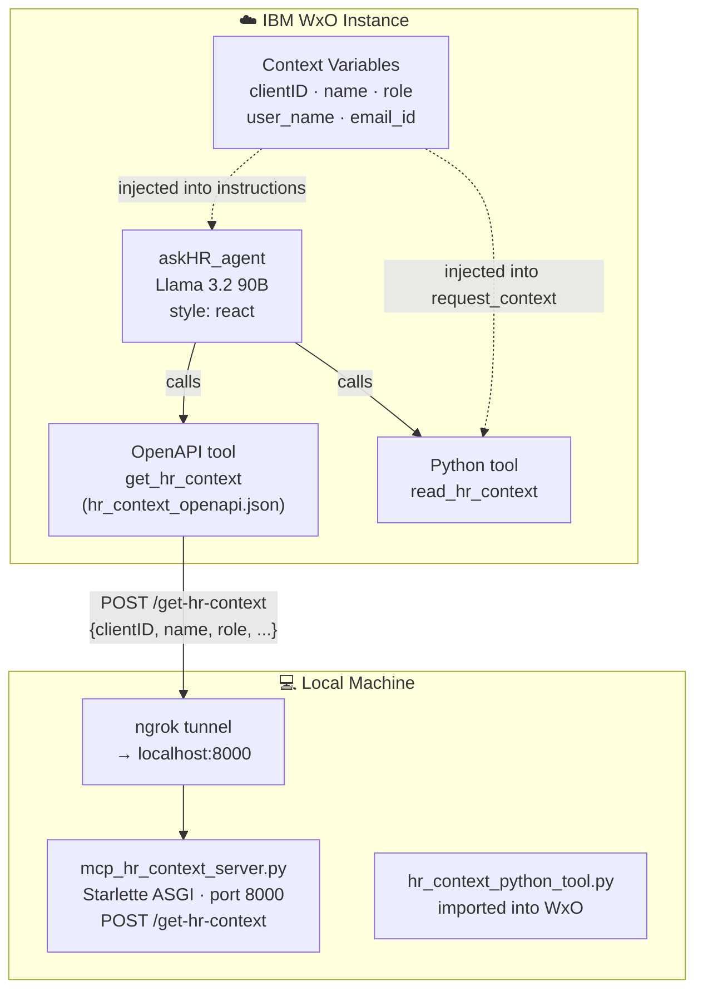
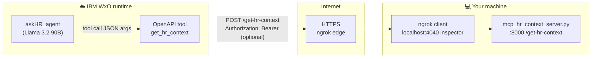

# askHR Agent — Context Variables + MCP Tool E2E Test

A fully self-contained end-to-end test validating that **WatsonX Orchestrate context variables** (`clientID`, `name`, `role`, `user_name`, `email_id`) are correctly injected into the `askHR_agent` and forwarded to an MCP tool server. Two distinct propagation patterns are tested side by side.

> **Agent model:** `watsonx/meta-llama/llama-3-2-90b-vision-instruct`  
> **Agent style:** `react`  
> **Context variables:** clientID · name · role · user_name · email_id

---

## Table of Contents

1. [What this test proves](#what-this-test-proves)
2. [Architecture](#architecture)
3. [The two context-passing patterns](#the-two-context-passing-patterns)
4. [File map](#file-map)
5. [Prerequisites](#prerequisites)
6. [Step-by-step guide](#step-by-step-guide)
7. [Expected test results](#expected-test-results)
8. [Troubleshooting](#troubleshooting)
9. [References](#references)

---

## What this test proves

| Question | Pattern | Answer |
|---|---|---|
| Does WxO substitute context variable values into agent instructions before sending them to the LLM? | A | ✅ `{clientID}` → `CLIENT-001` in system prompt |
| Does the LLM correctly forward those substituted values as tool arguments to the MCP server? | A | ✅ All 5 arrive at `POST /get-hr-context` |
| Does WxO inject context variables into `AgentRun.request_context` for Python tools without LLM mediation? | C | ✅ `request_context.get("clientID")` returns the value |
| Does WxO inject the user's Bearer token into outbound tool HTTP calls? | B | ✅ `Authorization: Bearer <JWT>` on every call |
| Are WxO system variables (`wxo_email_id` etc.) also available in `request_context`? | C | ✅ Auto-injected — no declaration needed in agent YAML |

## WxO system variables (auto-injected)

Every agent automatically receives these variables in `request_context` without declaring them in `context_variables`. They are **reserved** — never use the `wxo_` prefix for custom variable names.

| Variable | Value | Use case |
|---|---|---|
| `wxo_email_id` | Authenticated user's email | Identity, audit trails, OBO token exchange |
| `wxo_user_name` | Authenticated user's display name | Personalisation |
| `wxo_tenant_id` | WxO tenant (instance) ID | Multi-tenant routing |
| `wxo_thread_id` | Current conversation thread ID | State management, logging |
| `wxo_run_id` | Current run ID | Trace correlation, debugging |

```python
# Read in a Python tool — no agent YAML changes needed
req = context.request_context
email     = req.get("wxo_email_id",  "NOT_AVAILABLE")
thread_id = req.get("wxo_thread_id", "NOT_AVAILABLE")
run_id    = req.get("wxo_run_id",    "NOT_AVAILABLE")
```

> **Note:** `wxo_thread_id` and `wxo_run_id` are only populated when there is an active authenticated session (web chat or `/runs` API with auth). They may be `NOT_AVAILABLE` in unauthenticated CLI test runs.

---

## Architecture



### Component diagram



---

## How context variables reach the agent — official mechanisms

> **Source:** [WxO Developer Docs — Context variables](https://developer.watson-orchestrate.ibm.com/webchat/context_variables)

Context variable values **cannot** be set via the `orchestrate` CLI. They reach the agent runtime through exactly two paths:

| Method | How | Best for |
|---|---|---|
| **Method 1 — JWT token** | Embed a `context` claim in the signed RS256 JWT passed to the web chat embed | Stable identity: `clientID`, `role`, `user_name` |
| **Method 2 — `/runs` API** | POST context in the request body to `/v1/runs` (this is what the web chat `pre:send` event uses internally) | Dynamic values, scripted/API testing |

```javascript
// Method 1 — JWT context claim (server-side)
const jwtContent = {
  sub: "user-id",
  context: {
    clientID: "865511",
    user_name: "Ava",
    role: "Admin",
  }
};

// Method 2 — pre:send event / /runs API payload
function preSendHandler(event, instance) {
  event.message.context = {
    ...event.message.context,
    clientID: "12345",
    name: "Jane Doe",
    email_id: "jdoe@example.com"
  };
}
```

> **Important:** If the same variable name exists in both JWT and `/runs` payload, **JWT takes precedence**.  
> Never use the `wxo_` prefix — it is reserved for system variables.

## The three tool patterns tested

### Pattern A — LLM-mediated argument injection (OpenAPI tool)

Once context values arrive in the agent runtime (via JWT or `/runs` API), WxO substitutes them into the agent's `instructions` field before sending the system prompt to the LLM. The LLM sees the substituted values and is instructed to pass them as tool arguments to `POST /get-hr-context`.

**What is validated:** WxO instruction substitution → LLM argument forwarding → MCP server receipt

**Trigger phrase:** `"show my HR context"`

### Pattern C — Direct Python tool `request_context` read

WxO populates `AgentRun.request_context` with the declared `context_variables` before executing any Python tool. The tool reads them directly — no LLM involvement:

```python
req = context.request_context
client_id = req.get("clientID", "NOT_INJECTED")
```

**What is validated:** WxO `request_context` population → Python tool direct read

**Trigger phrase:** `"read context directly"`

### Pattern B — Bearer token in HTTP headers

On every outbound OpenAPI tool HTTP call, WxO injects `Authorization: Bearer <JWT>` from the linked connection. The MCP server reads it independently of the tool arguments.

---

## File map

| File | Purpose |
|---|---|
| [`mcp_hr_context_server.py`](mcp_hr_context_server.py) | **MCP server.** Starlette ASGI. Routes: `POST /get-hr-context` (receives 5 context vars, validates, returns HR summary), `GET /health`, `GET /sse` (MCP SSE transport). |
| [`hr_context_openapi.json`](hr_context_openapi.json) | **WxO OpenAPI tool spec.** Defines `get_hr_context` operation (`POST /get-hr-context`). Declares all 5 context variable fields as required body parameters. |
| [`tools/hr_context_python_tool.py`](tools/hr_context_python_tool.py) | **Python tool.** Reads all 5 context variables from `AgentRun.request_context` directly (Pattern C). |
| [`agents/askhr_agent.yaml`](agents/askhr_agent.yaml) | **Agent definition.** `style: react`, `llm: watsonx/meta-llama/llama-3-2-90b-vision-instruct`, `context_access_enabled: true`, lists all 5 context variables. |
| [`deploy_to_wxo.sh`](deploy_to_wxo.sh) | **Deploy script.** Imports OpenAPI tool, Python tool, and agent into the active WxO environment. |
| [`test_context_via_api.sh`](test_context_via_api.sh) | **API test script.** POSTs to `/v1/runs` with context variables in the body (Method 2). This is the correct way to inject context programmatically. |
| [`run_e2e_test.sh`](run_e2e_test.sh) | **E2E test runner.** Local server tests + CLI chat (no context vars via CLI). |
| [`test_server_local.sh`](test_server_local.sh) | **Local smoke test.** Starts `mcp_hr_context_server.py`, runs 4 direct `curl` POST tests, no WxO account needed. |
| [`.env.template`](.env.template) | Environment variable template. Copy to `.env` and fill in. |
| [`requirements.txt`](requirements.txt) | Python dependencies. |

---

## Prerequisites

| Requirement | Version tested | Install |
|---|---|---|
| Python | 3.12 | `brew install python` |
| `mcp` + `starlette` + `uvicorn` | latest | `pip install -r requirements.txt` |
| IBM WxO ADK (`orchestrate` CLI) | 2.6.0+ | IBM internal distribution |
| `ngrok` | free tier | `brew install ngrok/ngrok/ngrok` |
| Active WxO DEV instance | — | IBM WxO trial or enterprise |

---

## Step-by-step guide

### Step 1 — Install dependencies

```bash
cd askhr_context_variables_test
pip install -r requirements.txt
```

### Step 2 — Smoke-test the server locally (no WxO needed)

```bash
./test_server_local.sh
```

Expected: 4 tests pass — health check, all-5-vars POST, partial POST, Bearer token extraction.

### Step 3 — Create your `.env` file

```bash
cp .env.template .env
# Edit .env with your WxO instance URL and API key
```

### Step 4 — Start the MCP server

```bash
python mcp_hr_context_server.py
# Leave this running in a separate terminal
```

### Step 5 — Expose via ngrok

```bash
ngrok http 8000
# Copy the https URL, e.g.: https://abc123.ngrok-free.app
```

Update `hr_context_openapi.json` — replace the `servers[0].url` placeholder:

```json
"servers": [{ "url": "https://abc123.ngrok-free.app" }]
```

### Step 6 — Activate WxO CLI environment

```bash
source .env
orchestrate env activate DEV   # or your environment name
orchestrate env list           # confirm (active) is shown
```

### Step 7 — Set context variable values in the WxO UI

The `orchestrate` CLI has no `context` command. Context variable values must be set via the **WxO UI**:

1. Open `https://dl.watson-orchestrate.ibm.com`
2. Go to **Settings → Context Variables**
3. Add each variable with its value:

| Variable | Example value |
|---|---|
| `clientID` | `CLIENT-001` |
| `name` | `Jane Doe` |
| `role` | `HR Manager` |
| `user_name` | `jdoe` |
| `email_id` | `jdoe@example.com` |

These values are stored per-user in WxO and injected into the agent's instructions at chat time, replacing `{clientID}`, `{name}`, etc.

### Step 8 — Deploy

```bash
./deploy_to_wxo.sh
```

### Step 9 — Test context variable injection via REST API

The `orchestrate chat ask` CLI has no mechanism to pass context variable values.
Use the API test script instead, which POSTs to `/v1/runs` with context in the payload:

```bash
./test_context_via_api.sh
```

### Step 10 — Run the full E2E test (server-side validation)

```bash
./run_e2e_test.sh
```

### Step 11 — Test via WxO web chat (JWT method)

To test Method 1 (JWT token), embed context in the signed token's `context` claim:

```javascript
const jwtContent = {
  sub: "jdoe",
  context: {
    clientID: "CLIENT-001",
    name: "Jane Doe",
    role: "HR Manager",
    user_name: "jdoe",
    email_id: "jdoe@example.com"
  }
};
```

Then open the WxO web chat and ask `"show my HR context"` — the LLM will see the
substituted values in its instructions and forward them to the MCP server.

---

## Expected test results

### Pattern A — LLM-mediated context injection — validated ✅

> **Run date:** Apr 28 2026 · WxO ADK · Llama 3.2 90B Vision · `/v1/orchestrate/runs` API

**Test script output (`./test_context_via_api.sh`):**

```
✅ Bearer token obtained (1457 chars)
✅ Agent ID: 660014d3-09f8-4b4c-bddc-6f11be1b8f45

Test 1 — POST /v1/orchestrate/runs with all 5 context variables
✅ Run submitted — run_id: 40f4ac61-def7-4a46-84e7-92bea5d6d68a
   poll 1/15 — state=running

── Tool call args (what the LLM sent to the MCP server):
{
  "name":      "Jane Doe",
  "role":      "HR Manager",
  "clientID":  "CLIENT-001",
  "email_id":  "jdoe@example.com",
  "user_name": "jdoe"
}

✅ Test 1 PASS: all 5 context variables injected and forwarded as tool args
```

**What it proves:**
- WxO substituted `{clientID}`, `{name}`, `{role}`, `{user_name}`, `{email_id}` into the agent instructions
- Llama 3.2 90B read the substituted values and forwarded all 5 as exact tool call arguments
- The tool call arrived at the MCP server with all values intact

> **Note on Test 2 (partial context):** When `email_id` is omitted from the `/runs` context payload, the LLM passes the literal `{email_id}` placeholder string as the argument value. WxO does not substitute it — unset variables remain as raw `{variable_name}` tokens in the instructions.

### Pattern A — MCP server validation (requires ngrok)

Once `hr_context_openapi.json` is updated with a live ngrok URL, the MCP server logs confirm receipt:

```
── POST /get-hr-context
   ✅ context vars present=True
{
  "status": "success",
  "context_variables_received": {
    "clientID":  "CLIENT-001",
    "name":      "Jane Doe",
    "role":      "HR Manager",
    "user_name": "jdoe",
    "email_id":  "jdoe@example.com"
  },
  "validation": { "all_context_variables_present": true, "missing": [] },
  "hr_summary": "HR profile loaded for Jane Doe (jdoe@example.com). Role: HR Manager. Client: CLIENT-001. Login: jdoe."
}
```

### Pattern C — Python tool (`read_hr_context`)

Use **embedded webchat + JWT or `pre:send`** (so `context` is sent), **or** any flow where WxO merges those keys into `request_context`. The **portal UI alone** typically does **not** populate declared custom vars, so Pattern C matches **REST/embed**, not exploratory portal chat unless your tenant injects defaults.

```
════════════════════════════════════════════════════════
  HR Context — Pattern C (direct request_context read)
════════════════════════════════════════════════════════

  ── Custom HR Context Variables ─────────────────────
  Status    : ✅ ALL PRESENT
  clientID  : CLIENT-001
  name      : Jane Doe
  role      : HR Manager
  user_name : jdoe
  email_id  : jdoe@example.com

  ── WxO System Variables (auto-injected) ────────────
  Status         : ✅ 5/5 injected
  wxo_email_id   : markusvankempen43@gmail.com
  wxo_user_name  : Markus van Kempen
  wxo_tenant_id  : 20260409-1024-...
  wxo_thread_id  : 902d19e7-...
  wxo_run_id     : 784ab97e-...
════════════════════════════════════════════════════════
```

---

## Troubleshooting

### Why the hosted WxO portal UI shows empty `clientID`, `MISSING`, and `NOT_INJECTED`

**This is expected, not a misconfiguration.**

Per [official context variable documentation](https://developer.watson-orchestrate.ibm.com/webchat/context_variables), custom context values (`clientID`, `name`, `role`, …) are **supplied only** when:

1. **JWT (secure embed)** — your server signs a JWT whose payload includes `context: { … }`, and you pass that JWT into embedded webchat, or  
2. **`pre:send` / `/runs` payload** — your **embedded** web page registers `instance.on('pre:send', …)` so each outbound message carries `event.message.context = { … }`, **or** you call **`POST …/v1/orchestrate/runs`** yourself with `"context": { … }`.

The **built-in WxO portal chat** (browser login at `watson-orchestrate.ibm.com`) does **not** automatically attach those key-value pairs. So `{clientID}` stays **literally unsubstituted**, the model may answer `"Your clientID is "` (nothing), **`read_hr_context`** reads **`NOT_INJECTED`**, and system variables may appear missing depending on sandbox behavior.

That is exactly why `./test_context_via_api.sh` works (it sends `context` on `/runs`) while **portal UI** chats do **not**, until you integrate **embed chat + JWT or `pre:send`**.

**What still works from the portal** (matches your screenshot): When **you paste JSON** yourself, the **LLM** can pass those values into **`get_hr_context`** because the OpenAPI schema asks for structured args — but that proves **manual** args, **not** platform injection into `request_context`.

### How to test custom context correctly

| Scenario | Approach |
|---|---|
| Scripted / regression | `./test_context_via_api.sh` (`/v1/orchestrate/runs` + `context`) |
| Real browser + auto-injected context | [Embedded watsonx Orchestrate webchat](https://developer.watson-orchestrate.ibm.com/webchat/context_variables) with JWT **or** `pre:send` handler |
| Portal UI exploratory chat | Expect **missing** injection; use MCP OpenAPI tool by **typing** structured values — or paste JSON as a workaround |

### Symptom table

| Symptom | Likely cause | Fix |
|---|---|---|
| Portal UI: empty `clientID`, `NOT_INJECTED` for custom vars | Portal does not send `context` per docs | Use `/runs` API script, or embed JWT / `pre:send`; do not expect portal-only to populate `request_context` |
| `status: partial` when calling MCP from API | Omitting a required key from `/runs` `context` | Include all five keys in `"context"` |
| Tool not found / 424 / DNS errors | Wrong or stale ngrok URL in imported OpenAPI | Update `servers[0].url`, `orchestrate tools import --file hr_context_openapi.json --kind openapi` |
| Agent empty response / tool errors | `style: react` + model quirks | Try `style: default` in `agents/askhr_agent.yaml`, re-import |
| `ModuleNotFoundError: ibm_watsonx_orchestrate.run.context` | Cloud sandbox import nuance | The `AgentRun = object` fallback in the Python tool is intentional |
| Bearer `NOT_FOUND` on MCP | No connection tied to OpenAPI tool (direct `curl`) | Attach connection if you require Pattern B JWT on the wire |

---

## Architecture — WxO outbound OpenAPI tool → ngrok → local MCP

When `hr_context_openapi.json` points at an **ngrok** URL, Orchestrate’s runtime calls your tunnel; ngrok forwards to **`localhost:8000`** where **`mcp_hr_context_server.py`** handles **`POST /get-hr-context`**. Implementation details (validation rules, empty-string semantics, Bearer logging) live in **`_build_hr_context_response`** and **`handle_get_hr_context`** in that file.



**How to interpret live logs:**

- **`client=3.226.x.x`** / **`34.234.x.x`** — egress IP of the WxO tool runner hitting your tunnel (varies per request pool).
- **`Request body:`** — the exact JSON body after OpenAPI deserialization and LLM tool args (grep this line to debug flaky **`email_id: ''`** turns).
- **`✅ context vars present=True`** — all five strings are non-empty (see **`_build_hr_context_response`** empty-string checks in code).
- **`⚠️ context vars present=False`** — same handler; at least one of `clientID`, `name`, `role`, `user_name`, `email_id` is missing, **`null`**, or **`""`**. HTTP remains **200**; business validation is inside the JSON.
- **`Bearer identity: NOT_FOUND`** — no **`Authorization: Bearer`** on that request (typical without a WxO connection on the tool, or local **`curl`** without **`--header`**). Independent of Pattern A HR fields.

---

## Validated logs — live ngrok + MCP (Apr 2026)

The following excerpts are representative of a healthy end-to-end run: WxO invokes the tunnel, the Starlette handler logs structured lines, ngrok shows **HTTP 200** for each **`POST /get-hr-context`**.

### MCP server (`python mcp_hr_context_server.py`)

```text
20:36:28 DEBUG      Request body: {'clientID': 'CLIENT-001', 'email_id': 'jdoe@example.com', 'name': 'Jane Doe', 'role': 'HR Manager', 'user_name': 'jdoe'}
20:36:28 INFO       Bearer identity: NOT_FOUND
20:36:28 INFO       ✅ context vars present=True (0.1 ms)
20:36:38 INFO    ── POST /get-hr-context  client=3.226.211.228
20:36:38 DEBUG      Request body: {'clientID': 'CLIENT-001', 'email_id': '', 'name': 'Jane Doe', 'role': 'HR Manager', 'user_name': 'jdoe'}
20:36:38 INFO       Bearer identity: NOT_FOUND
20:36:38 INFO       ⚠️ context vars present=False (0.1 ms)
20:37:13 INFO    ── POST /get-hr-context  client=34.234.135.232
20:37:13 DEBUG      Request body: {'clientID': 'CLIENT-001', 'email_id': 'jdoe@example.com', 'name': 'Jane Doe', 'role': 'HR Manager', 'user_name': 'jdoe'}
20:37:13 INFO       Bearer identity: NOT_FOUND
20:37:13 INFO       ✅ context vars present=True (0.2 ms)
20:42:15 INFO    ── POST /get-hr-context  client=34.234.135.232
20:42:15 DEBUG      Request body: {'clientID': 'CLIENT-002', 'email_id': 'jdoe2@example.com', 'name': 'Jane Doe2', 'role': 'HR Manager', 'user_name': 'jdoe2'}
20:42:15 INFO       Bearer identity: NOT_FOUND
20:42:15 INFO       ✅ context vars present=True (0.3 ms)
```

**Teaching moment:** **`email_id`: `''`** (second block) proves the orchestration stack can serialize an **empty string** for a required field; the handler correctly flags **`partial`** /**`present=False`** while still returning HTTP 200 to the caller.

### ngrok web UI (`http://127.0.0.1:4040`)

```text
Session Status                online
Region                        United States (us)
Web Interface                 http://127.0.0.1:4040
Forwarding                    https://0ea1-99-239-88-232.ngrok-free.app -> http://localhost:8000

HTTP Requests
-------------

20:42:15.759 EDT POST /get-hr-context           200 OK
20:37:13.762 EDT POST /get-hr-context           200 OK
20:36:38.921 EDT POST /get-hr-context           200 OK
20:36:28 …                                     200 OK
```

Tunnel hostname and timestamps will differ on your machine; the invariant is **`POST /get-hr-context` → 200 OK** for each WxO outbound call.

---

## References

1. [context_injection_test](../context_injection_test/README.md) — Python tool `request_context` pattern (Pattern C baseline)
2. [mcp_user_context_test](../mcp_user_context_test/README.md) — Bearer token header injection (Pattern B/A baseline)
3. [context_ids_test](../context_ids_test/README.md) — Conversation ID patterns (`thread_id`, `trace_id`)

---

**Author:** Markus van Kempen | mvk@ca.ibm.com  
[Research | Floor 7½ 🏢🤏](https://pages.github.ibm.com/mvankempen/homepage/)  
*No bug too small, no syntax too weird.*
