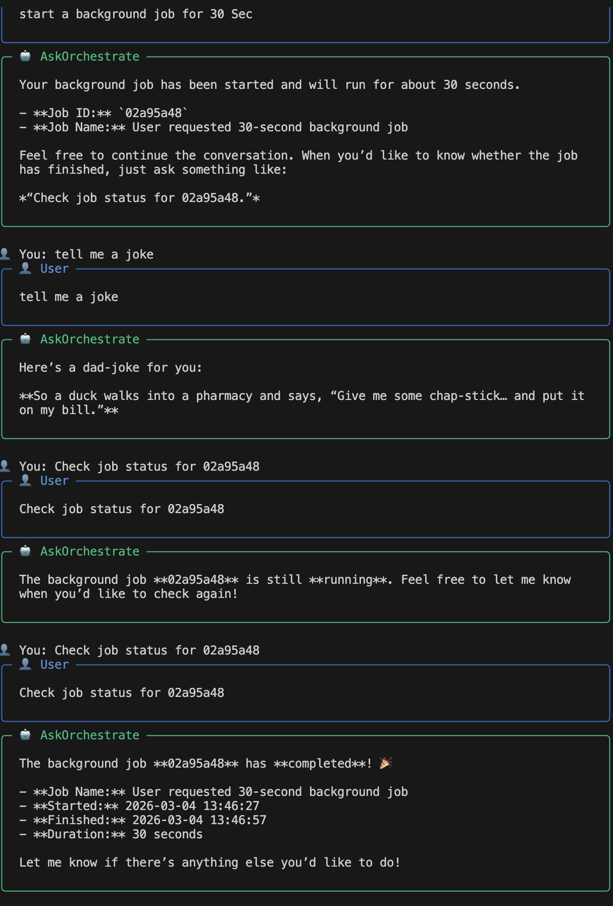
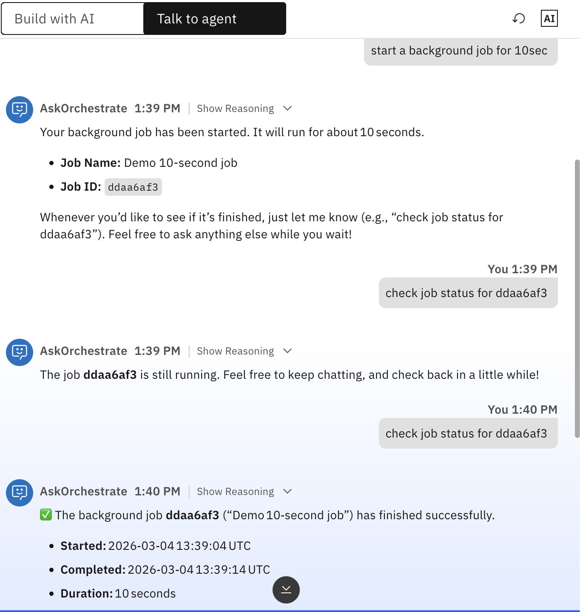

# WxO Asynchronous Tool Pattern
*by Markus van Kempen*

This directory contains a complete example of how to build and test **Long-Running Background Tools** in IBM watsonx Orchestrate — tools that take minutes or hours to complete, without blocking the user's chat.

---

## Two Approaches

This example demonstrates **two approaches** to handling long-running jobs in WxO:

| Approach | Pattern | User Blocked? | Files |
|---|---|---|---|
| **1. Python Tools (Recommended ✅)** | Fire-and-forget + polling | **No** — user chats freely | `async_tools.py` + `async_app.py` |
| **2. OpenAPI Callback** | `callbackUrl` + `202 Accepted` | **Yes** — thread blocked until callback | `openapi.yaml` + `async_app.py` |

---

## Approach 1: Python Tools (Non-Blocking ✅)

This is the **recommended** approach. It uses two simple Python tools:

- **`start_background_job`** — Kicks off the job via the REST API, returns a `job_id` instantly. The user is **never blocked**.
- **`check_job_status`** — User asks *"is my job done?"* whenever they want, and the agent checks the status.

### How it Works

```
User: "Start a background job for 30 seconds"
  └─ Agent calls start_background_job() → REST API returns job_id instantly
  └─ Agent responds: "✅ Job 173f0f5b started! Keep chatting!"

User: "Tell me a dad joke"
  └─ Agent responds normally (not blocked!)

User: "Check job status for 173f0f5b"
  └─ Agent calls check_job_status("173f0f5b") → REST API returns status
  └─ Agent responds: "⏳ Still running..." or "🎉 Complete!"
```

### Real Chat Transcript (Watson Orchestrate Web UI)

> **You:** start background job for 30 sec
>
> **Agent:** Your background job has been started and will run for about 30 seconds.
> - Job ID: 173f0f5b
> - Job name: User requested 30‑second job
>
> Feel free to keep chatting. When you'd like to see if the job has finished, just let me know (e.g., "check job status for 173f0f5b").
>
> **You:** tell me a Dad joke
>
> **Agent:** Why did the girl smear peanut butter on the road? To go with the traffic jam.
>
> **You:** check job status for 173f0f5b
>
> **Agent:** The background job 173f0f5b is still running. Feel free to ask again in a little while!
>
> **You:** tell me a Dad joke
>
> **Agent:** It's difficult to say what my wife does—she sells sea shells by the sea shore.
>
> **You:** check job status for 173f0f5b
>
> **Agent:** Great news—the background job 173f0f5b has finished! 🎉
>
> **You:** can u show check job status/information for 173f0f5b
>
> **Agent:**
> - **Job ID:** 173f0f5b
> - **Job Name:** User requested 30‑second job
> - **Status:** ✅ Complete
> - **Started At:** 2026‑03‑04 13:42:16 UTC
> - **Completed At:** 2026‑03‑04 13:42:46 UTC
> - **Duration:** 30 seconds
> - **Records Processed:** 1,260

### Screenshots

**ADK CLI Chat — Non-blocking background job with jokes in between:**



**Watson Orchestrate Web UI — Same flow in the browser:**



---

## Approach 2: OpenAPI Callback (Thread-Blocking)

This approach uses the **OpenAPI Callback Specification**. The conversation thread is **blocked** while waiting for the webhook — the user cannot chat until the job finishes and posts back to the `callbackUrl`.

### How it Works

1. **The Request:** Agent calls your tool. WxO injects a unique webhook URL into the `callbackUrl` HTTP header.
2. **The Hand-off:** Your API immediately returns `HTTP 202 Accepted`.
3. **The Wait:** The conversation thread is blocked. The UI shows: *"Tool is processing the request. This thread will remain blocked until the tool completes."*
4. **The Callback:** Your background process finishes and POSTs results to the `callbackUrl`.
5. **The Alert:** WxO receives the callback and the agent automatically reports the results.

### Important Rules for OpenAPI Callback Tools

1. **Header Name:** The header parameter *must* be named `callbackUrl` exactly in your OpenAPI spec.
2. **Response Code:** Your API endpoint *must* return a `202 Accepted` status code initially.
3. **Callback Content Type:** The payload you POST back to the `callbackUrl` *must* be `Content-Type: application/json`.
4. **Timeouts:** If the background job fails to POST back within the internal TTL (usually hours/days), WxO will time out.

---

## Setting Up the Example

### 1. Start the Python Flask App
This app provides the REST API backend for both approaches.

```bash
pip install flask requests ibm-watsonx-orchestrate
python3 async_app.py
```
*The server will start on port 5055.*

**Alternative: Use [Beeceptor](https://app.beeceptor.com) (no local server needed)**

If you don't want to run a local Flask app, you can use [Beeceptor](https://app.beeceptor.com) to create a free mock API endpoint in seconds:

1. Go to [app.beeceptor.com](https://app.beeceptor.com) and create a new endpoint (e.g., `my-wxo-test`)
2. Set up mock rules for `POST /start-job` to return `{"job_id": "mock123", "status": "Queued"}`
3. Set up mock rules for `GET /job-status/mock123` to return `{"status": "Success", "message": "Done!"}`
4. Use the Beeceptor URL (e.g., `https://my-wxo-test.free.beeceptor.com`) as your `BASE_URL`

This is useful for quick testing without any local infrastructure.

### 2. Expose it to the Public Internet
Watson Orchestrate needs a public URL to reach your local API.

```bash
ngrok http 5055
```
*(Copy the `https://...ngrok-free.app` URL it gives you)*

### 3. Update the URL in `async_tools.py`
Open `async_tools.py` and update the `BASE_URL` variable:
```python
BASE_URL = "https://your-unique-id.ngrok-free.app"
```

### 4. Deploy the Python Tools (Recommended)
```bash
orchestrate env activate DEV
orchestrate tools import --kind python -f async_tools.py
```

### 5. Assign Tools to Your Agent
In the WxO Web UI or Builder extension, assign these tools to your agent:
- `start_background_job`
- `check_job_status`

### 6. Test It!
```bash
orchestrate chat ask -n YourAgentName
```
Or open the Watson Orchestrate Web UI and start chatting!

---

## Files in this Directory

| File | Description |
|---|---|
| `async_app.py` | Flask REST API server with `/start-job`, `/job-status/<id>`, and `/long-task` (callback) endpoints |
| `async_tools.py` | Python tools for WxO: `start_background_job` and `check_job_status` |
| `openapi.yaml` | OpenAPI spec for the callback-based approach (Approach 2) |
| `requirements.txt` | Python dependencies: `flask`, `requests`, `ibm-watsonx-orchestrate` |
| `README.md` | This documentation |

---

## Troubleshooting

The generic WxO error **`"Error getting Python tool status"`** (with `duration ~100s`) is the platform's catch-all timeout. Four root causes in order of likelihood:

### Issue 1 — `BASE_URL` is still the placeholder (most common)

`async_tools.py` line 13:
```python
BASE_URL = "https://your-ngrok-url.ngrok-free.app"  # ← never updated
```
Every `requests.post()` call fails with a `ConnectionError`. WxO's executor catches it and after the platform timeout (~100 s) returns the generic error instead of the tool's own `❌ Failed to start background job: {e}` message.

**Fix:** Set the correct URL and re-import the tool:
```bash
orchestrate tools import --kind python -f async_tools.py
```

### Issue 2 — Stale ngrok URL (ngrok free tier changes URL on restart)

The URL is baked into the Python code at import time. When ngrok restarts the URL changes — the tool must be re-imported every ngrok session.

**Better fix — read the URL from an environment variable:**
```python
import os
BASE_URL = os.getenv("ASYNC_TOOL_BASE_URL", "https://your-ngrok-url.ngrok-free.app")
```
Then set the env var when importing (check if your ADK version supports `--env` on tool import). Or use IBM Code Engine for a stable permanent URL — see Issue 3.

### Issue 3 — WxO executor blocks outbound calls to `*.ngrok-free.app`

WxO Python tools run in IBM Cloud. There is a known network policy that may block outbound calls to `*.ngrok-free.app` and `*.ngrok.io` hostnames. The tool request never reaches your local Flask app — no error appears on the ngrok side at all.

**Debug step — test outbound network access with a known-good public URL:**
```python
@tool
def test_outbound() -> str:
    """Test if WxO executor can reach the public internet."""
    import requests
    try:
        r = requests.get("https://httpbin.org/get", timeout=10)
        return f"✅ Outbound OK: {r.status_code}"
    except Exception as e:
        return f"❌ Outbound blocked: {e}"
```
Import and call it. If it returns `❌`, WxO is blocking all outbound calls — ngrok will never work.

**Permanent fix — deploy to IBM Code Engine:**
```bash
# Build and deploy async_app.py as a Code Engine application
# Result: a stable HTTPS URL that is always reachable from within IBM Cloud
ce app create async-tool-backend --image <your-image> --port 5055
```
Then update `BASE_URL` in `async_tools.py` to the Code Engine URL — no re-import needed on restart.

### Issue 4 — Missing `requests` in WxO executor image

The tool folder had no `requirements.txt`. If `requests` is not pre-installed in the tenant's executor image, `import requests` fails silently at import time and WxO returns the generic error.

**Fix:** A `requirements.txt` is now included in this directory:
```
flask>=3.0.0
requests>=2.31.0
ibm-watsonx-orchestrate>=2.9.0
```
Make sure it is present alongside `async_tools.py` when importing.

### Proof / debug sequence

```
Step 1 → call test_outbound tool → if ❌, WxO blocks all outbound (ngrok impossible)
Step 2 → if Step 1 ✅, test ngrok URL directly with test_outbound targeting your ngrok URL
Step 3 → if Step 2 ✅, check BASE_URL matches current ngrok session URL
Step 4 → verify requirements.txt is present when importing tools
```

---

## FAQ: Background Processes in Watson Orchestrate

### Q: Can I run a persistent background process *on the WxO tenant itself*?

**No.** WxO tools are request → response. They execute when called by the agent and return a result. They cannot run as long-lived daemons or persistent background services on the tenant.

### Q: So how do I handle long-running jobs or event-driven alerting?

You **decouple** the background process to an external service (e.g., IBM Code Engine, a Kubernetes container, a serverless function) and use WxO tools to **integrate** with it. There are three proven patterns:

| Pattern | How It Works | User Blocked? | Best For |
|---|---|---|---|
| **A. Python Tools (fire & poll)** | Tool 1 starts the job → returns instantly. Tool 2 checks status on demand. | **No** | Jobs where user wants control over when to check |
| **B. OpenAPI Callback** | Tool starts job → returns `202`. External service POSTs back to `callbackUrl` when done. Agent auto-alerts. | **Yes** (thread blocked) | Jobs where auto-notification is critical |
| **C. Scheduled Workflows** | WxO periodically triggers an agentic workflow that polls the external service. | **No** | Continuous monitoring / event watching |

### Q: Can a tool "continuously run in the background and alert the agent when a specific event has occurred"?

**Not as a tool running on the tenant**, but you can achieve the same result:

1. **Deploy a listener** to Code Engine (or similar) that watches for the event.
2. **Option A:** Use the **OpenAPI Callback pattern** — when the event fires, Code Engine POSTs to the `callbackUrl` and the agent auto-alerts the user. *(Thread is blocked while waiting.)*
3. **Option B:** Use the **Python Tools pattern** — Code Engine updates a status endpoint. The user asks the agent to check whenever they want. *(No blocking.)*
4. **Option C:** Use a **Scheduled Agentic Workflow** — WxO periodically calls a tool that checks Code Engine for new events and notifies the user if something happened. *(No blocking, fully automated.)*

### Q: Do I need to use `subprocess` to spawn background processes from a tool?

**No.** Using `subprocess` inside a WxO Python tool is fragile and not recommended — the tool's execution environment is ephemeral. Instead, have your tool make an HTTP call to an external service (Code Engine, etc.) that manages the actual background work. This is exactly what our `start_background_job` tool does.

### Q: What does this example prove?

This repository contains a **fully working, end-to-end example** demonstrating:

- ✅ A Flask REST API that manages background jobs with `/start-job` and `/job-status/<id>` endpoints
- ✅ Two Python tools (`start_background_job`, `check_job_status`) deployed to WxO
- ✅ The user starting a 30-second job, chatting freely (asking for jokes!), and polling for status — **completely non-blocking**
- ✅ The OpenAPI Callback approach where the agent auto-alerts on completion (thread-blocking)
- ✅ Real screenshots from both the ADK CLI and the Watson Orchestrate Web UI

---


## Author

**Markus van Kempen** | mvk@ca.ibm.com  
[Research | Floor 7½ 🏢🤏](https://pages.github.ibm.com/mvankempen/homepage/)  
*No bug too small, no syntax too weird.*
