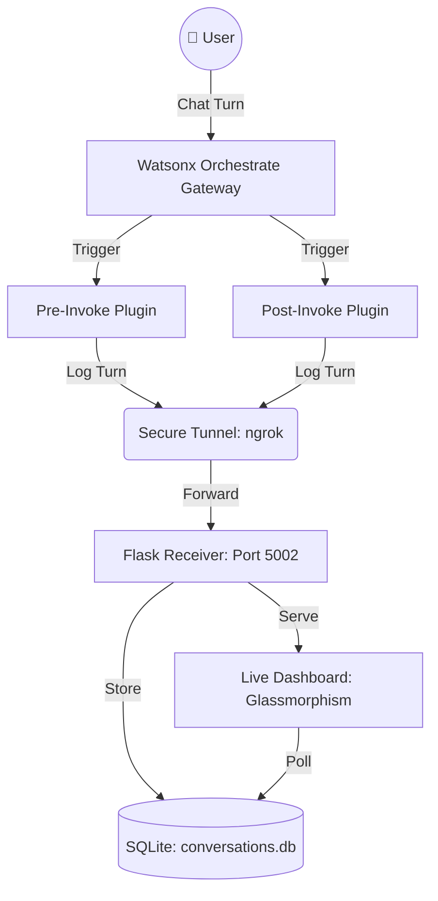

# 🔐 WxO Intelligence Vault v3.2

**Author:** Markus van Kempen | mvk@ca.ibm.com  
[Research | Floor 7½ 🏢🤏](https://pages.github.ibm.com/mvankempen/homepage/)  
*No bug too small, no syntax too weird.*

## 📋 Project Overview
The **WxO Intelligence Vault** is a high-performance, server-side conversation logging and auditing solution for IBM Watsonx Orchestrate. It captures every interaction turn (Pre-Invoke and Post-Invoke) directly from the WxO Gateway and stores them in a private, secure SQLite database.

Unlike client-side logging, this approach is **tamper-proof** and ensures that sensitive conversation data is never exposed to the browser.

## 🏗️ System Architecture



## 📂 Component Breakdown

### 1. `logging_plugin.py` (The Sensor)
- **Role:** Executes server-side on the WxO platform.
- **Logic:** 
  - `logging_pre_plugin`: Captures raw user input before the agent processes it.
  - `logging_plugin`: Captures the final assistant output and metadata.
- **Security:** Uses `metadata` extraction for identity and thread tracking.

### 2. `log_receiver.py` (The Vault & Engine)
- **Role:** A local Flask-based microservice that manages the private database.
- **Intelligence:**
  - **Smart Agent Resolver:** Maps technical UUIDs to human-readable names.
  - **Thread Persistence:** Generates unique thread clusters for conversation grouping.
  - **API:** Exposes `/log` (write) and `/view` (read) endpoints.

### 3. Live Dashboard (The Intelligence UI)
- **Role:** A real-time web interface served directly by the receiver.
- **Features:**
  - **Thread Stitching:** Merges pre/post-invoke fragments into single cards.
  - **Filtering Sidebar:** Instant search by Agent Name, Thread ID, or Keyword.
  - **Anti-Blink Sync:** Smart DOM updates every 5 seconds without page flashes.

### 4. `simulate_logging.py` (The Simulation Engine)
- **Role:** Verification tool to test the dashboard logic without needing WxO deployment.
- **Logic:** Simulates multi-agent scenarios with complex turn sequences.

### 5. `rest_e2e_test.py` (The API Validator)
- **Role:** Directly invokes the WxO Assistant API to trigger a live, end-to-end conversation turn.
- **Security:** Handles MCSP IAM token exchange and API key authentication.

## 🚀 Operational Guide

### 1. Initial Setup
```bash
# Install dependencies
pip install flask requests

# Initialize and start the receiver
python3 log_receiver.py
```

### 2. Establish Secure Connectivity
```bash
# Open a secure tunnel to your local vault
ngrok http 5002
```
*Note: Copy the `https://xxxx.ngrok-free.app` URL and update the `logging_plugin.py` constants.*

### 3. Deploy to WxO
```bash
# Deploy agents and plugins using environment credentials
./deploy_to_new_instance.sh
```

### 4. Auditing & Analysis
Access your live vault at:  
👉 **`http://localhost:5002`**

## 🛡️ Security & Performance
- **Fail-Open Design:** The plugins use 5s timeouts and silent exception handling to ensure that if the vault is offline, the user's chat experience is unaffected.
- **Private Parameters:** Database URLs are stored in the Gateway metadata, not hardcoded in client-side scripts.
- **Indexed SQLite:** The database is optimized for rapid retrieval and thread-based grouping.

---
*Developed for WxO-ToolBox | IBM Research*
