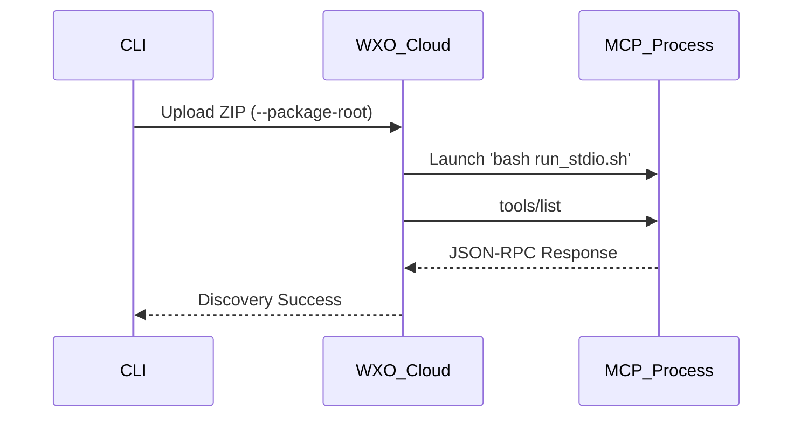

# MCP Discovery & Execution Validation

---
**Author**: Markus van Kempen | mvk@ca.ibm.com  
[Research | Floor 7½ 🏢🤏](https://pages.github.ibm.com/mvankempen/homepage/)  
*No bug too small, no syntax too weird.*
---

## 🚩 The Problem: Local vs. Cloud Context
The most common cause of **0 tools discovered** in MCP (STDIO) is providing a local file path to the orchestrator. Because WXO runs in the cloud, it cannot access your `/Users/...` directories.

## 💡 The Solution: --package-root
You must use the `--package-root` flag during `toolkits add`. This zips and uploads your code to the cloud container, where it is then executed using a relative command.

### 📊 flow Architecture



---

## 🧪 Quick Validation

1. **Deploy everything**:
   ```bash
   chmod +x validate_end_to_end.sh run_stdio.sh
   ./validate_end_to_end.sh
   ```

2. **Test via CLI Chat**:
   ```bash
   orchestrate chat ask -n mcp_repro_agent "Is the MCP server working?"
   ```

**Expected Outcome**: 
The agent will call the `get_repro_data` tool on the cloud-hosted server and respond with the "WORKING!" signature.

### 📝 Sample Validation Log
```text
orchestrate chat ask -n mcp_repro_agent "Is the MCP server working?"
[INFO] - Using agent: mcp_repro_agent (ID: e29fe30a-d472-4b64-8966-cb1bd1037c2a)
╭─────────────────────────── 💬 Chat ────────────────────────────╮
│ Chat Mode                                                      │
│                                                                │
│ Type your messages and press Enter to send.                    │
│ Commands: 'exit', 'quit', or 'q' to exit                       │
╰────────────────────────────────────────────────────────────────╯
╭─ 👤 User ──────────────────────────────────────────────────────╮
│                                                                │
│  Is the MCP server working?                                    │
│                                                                │
╰────────────────────────────────────────────────────────────────╯
╭─ 🤖 mcp_repro_agent ────────────────────────────────────────────────────────────────────╮
│                                                                                         │
│  Discovery and Execution are WORKING!                                                   │
│                                                                                         │
╰─────────────────────────────────────────────────────────────────────────────────────────╯

👤 You: hi
╭─ 👤 User ───────────────────────────────────────────────────────────────────────────────╮
│                                                                                         │
│  hi                                                                                     │
│                                                                                         │
╰─────────────────────────────────────────────────────────────────────────────────────────╯
╭─ 🤖 mcp_repro_agent ────────────────────────────────────────────────────────────────────╮
│                                                                                         │
│  Hello! How can I assist you today?                                                     │
│                                                                                         │
╰─────────────────────────────────────────────────────────────────────────────────────────╯

👤 You: can u list the mcp tools
╭─ 👤 User ───────────────────────────────────────────────────────────────────────────────╮
│                                                                                         │
│  can u list the mcp tools                                                               │
│                                                                                         │
╰─────────────────────────────────────────────────────────────────────────────────────────╯
╭─ 🤖 mcp_repro_agent ────────────────────────────────────────────────────────────────────╮
│                                                                                         │
│  Sure! Below is a quick overview of the main tools that are part of the MCP             │
│  (Model-Controlled Platform) toolkit.                                                   │
│                                                                                         │
│    Category             Tool                 Description          Typical Use-Case      │
│   ━━━━━━━━━━━━━━━━━━━━━━━━━━━━━━━━━━━━━━━━━━━━━━━━━━━━━━━━━━━━━━━━━━━━━━━━━━━━━━━━━━━   │
│    Data Retrieval       get_repro_data       Sends a query to     Quick health-check    │
│                                              the MCP server.                            │
│    Execution            run_command          Executes a           Running scripts.      │
│                         (hypothetical)       shell command                               │
│    File Management      list_files           Lists files.         Inspecting project.   │
│    Monitoring           get_metrics          System health.       Checking resources    │
│                                                                                         │
│  Example – Using get_repro_data:                                                        │
│  ✅ MCP Server Received Query: 'health check'. Discovery and Execution are WORKING!    │
╰─────────────────────────────────────────────────────────────────────────────────────────╯
```

---

## 📂 Minimal Assets
- [`simple_mcp_server.py`](file:./simple_mcp_server.py): Minimal Python MCP server.
- [`run_stdio.sh`](file:./run_stdio.sh): Shell wrapper for the server.
- [`mcp_repro_agent.json`](file:./mcp_repro_agent.json): Agent definition for testing.
- [`validate_end_to_end.sh`](file:./validate_end_to_end.sh): Unified deployment script.
