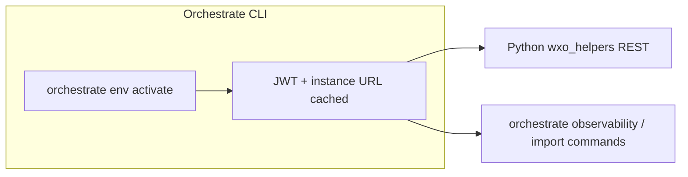
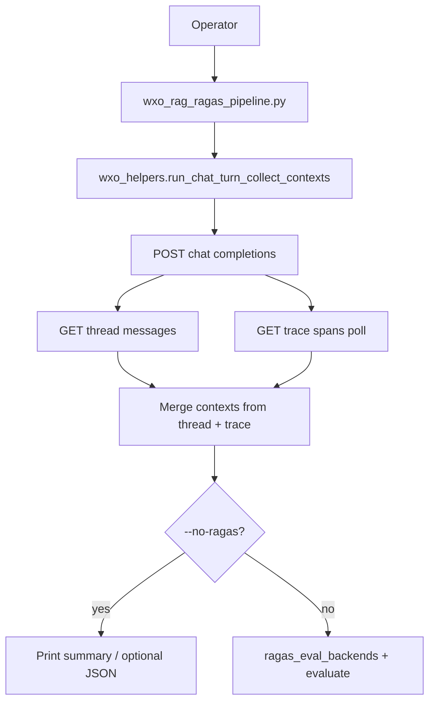
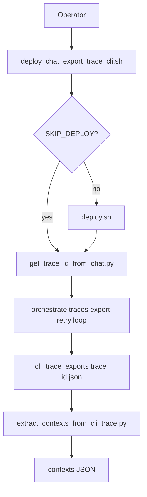
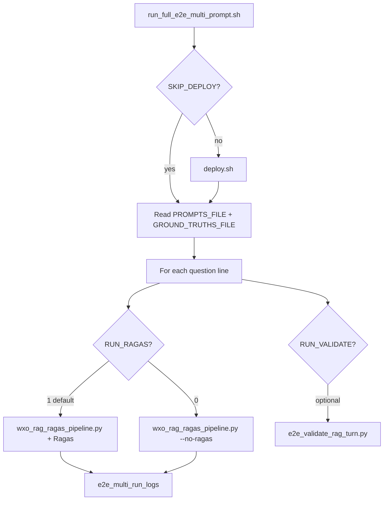
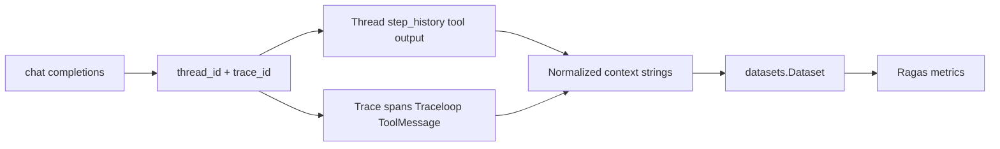

# Ragas RAG evaluation (WxO E2E probe)

Author: Markus van Kempen | mvk@ca.ibm.com  
[Research | Floor 7½ 🏢🤏](https://pages.github.ibm.com/mvankempen/homepage/)  
No bug too small, no syntax too weird.

---

## Contents

| Section | What you get |
|---------|----------------|
| [What this folder is](#what-this-folder-is) | Goals and scope |
| [Flow diagrams](#flow-diagrams) | Mermaid charts: REST pipeline, CLI export, multi-prompt |
| [Architecture](#architecture-conceptual) | Context recovery → Ragas |
| [Prerequisites](#prerequisites) | CLI, Python, judge credentials |
| [Setup](#setup) | venv + `pip` |
| [Quick start](#quick-start-happy-path) | Copy-paste commands |
| [Example run output](#example-multi-prompt-run-output) | Sample `deploy` + two-prompt Ragas scores |
| [Detailed reference](#detailed-script-reference) | Shell scripts, Python tools, agent YAML |
| [REST / CLI / Ragas](#rest-endpoints-python) | APIs, observability commands, metrics |
| [Ragas judge](#ragas-judge-openai-or-watsonxai) | OpenAI vs watsonx |
| [Security & troubleshooting](#security-and-pii) | PII, common failures |
| [Complete file inventory](#complete-file-inventory) | Every tracked path + one-line description |
| [Related library (parent repo)](#related-library-entries-read-only) | `evaluations_test`, `token_tracking_test`, … |

---

## What this folder is

An **end-to-end test bed** for **Watsonx Orchestrate (WxO)** agents that need **retrieved text** (RAG / tool output) for **Ragas** metrics such as **context precision** and **context recall**. It shows how to:

1. **Deploy** a stub agent + Python retriever tool.
2. Call **`POST /v1/orchestrate/{agent_id}/chat/completions`** (same shape as many production clients).
3. Recover **context passages** from **`GET /v1/orchestrate/threads/{thread_id}/messages`**, from **`GET /v1/traces/{trace_id}/spans`**, from **`orchestrate observability traces export`**, or from **exported JSON files**.
4. Optionally run **Ragas** `evaluate()` when an evaluator LLM is configured.

Patterns are **copied** from `evaluations_test/` and `token_tracking_test/`; those originals are **not** modified.

---

## Flow diagrams

View this file in **GitHub** or **VS Code Markdown preview** to render Mermaid.

### A. Auth (shared by Python and CLI)



### B. Single-turn REST pipeline (`wxo_rag_ragas_pipeline.py`)



### C. CLI trace export path (`deploy_chat_export_trace_cli.sh`)



### D. Multi-prompt batch (`run_full_e2e_multi_prompt.sh`)



### E. Where contexts come from (conceptual)



---

## Architecture (conceptual)

Same story as diagram **E**: WxO does not return `retrieved_chunks` on `chat/completions`; you **reconstruct** passages from **thread** APIs, **trace** APIs, or **CLI export JSON**, then feed Ragas.

---

## Prerequisites

| Requirement | Why |
|-------------|-----|
| **Orchestrate CLI** (`orchestrate` on `PATH`) | `deploy.sh`, `deploy_chat_export_trace_cli.sh`, `observability traces …` |
| **`orchestrate env activate <env>`** | Populates JWT + instance URL used by **Python** (`wxo_helpers`) from the same cache as the CLI |
| **Python 3.10+** (recommended) | Scripts and `pip install -r requirements.txt` |
| **`OPENAI_API_KEY`** (optional) | Ragas judge via OpenAI when using `--ragas-backend openai` or `auto` without watsonx env |
| **`requirements-ragas-watsonx.txt` + env** (optional) | Ragas **watsonx** judge: `WATSONX_URL` / `watsonx_url`, API key, `PROJECT_ID`; see [Ragas judge](#ragas-judge-openai-or-watsonxai) |

---

## Setup

```bash
cd ragas_rag_eval_e2e_test
python3 -m venv .venv && source .venv/bin/activate   # optional
pip install -r requirements.txt
orchestrate env activate YOUR_ENV
```

**Tool runtime** (agent’s Python tool in WxO) uses `tools/requirements.txt` during **`orchestrate tools import`**, not necessarily this venv.

---

## Quick start (happy path)

```bash
./deploy.sh
python wxo_rag_ragas_pipeline.py --agent-name ragas_rag_stub_agent --split-passages --dump-json --no-ragas
./run_e2e_test.sh
```

**One-shot multi-question** (optional deploy; **`RUN_RAGAS=1` by default** runs Ragas on **each** prompt — use `RUN_RAGAS=0` for `--no-ragas` only). Ground truth: `e2e_ground_truths_default.txt` (or `GROUND_TRUTHS_FILE` / `RAGAS_GROUND_TRUTH`).

```bash
chmod +x run_full_e2e_multi_prompt.sh   # once
./run_full_e2e_multi_prompt.sh
RUN_RAGAS=0 SKIP_DEPLOY=1 ./run_full_e2e_multi_prompt.sh
SKIP_DEPLOY=1 RUN_VALIDATE=1 ./run_full_e2e_multi_prompt.sh
# Ragas on last prompt only:
RUN_RAGAS=0 RUN_RAGAS_ON_LAST=1 RAGAS_GROUND_TRUTH="Aligned reference answer." ./run_full_e2e_multi_prompt.sh
```

Logs land under `e2e_multi_run_logs/` (git-ignored).

### Example multi-prompt run output

Excerpt from a real **`./run_full_e2e_multi_prompt.sh`** after **`./deploy.sh`** (watsonx judge via `RAGAS_BACKEND=auto`, stub agent **`ragas_rag_stub_agent`**, **`--split-passages`**). Long lines and the wide Ragas debug table are shortened; full detail is in `e2e_multi_run_logs/prompt_*.log`.

```text
./deploy.sh
==> Import Python tool (ragas_retrieve_stub)
[INFO] … Tool 'ragas_retrieve_stub' updated successfully
==> Import native agent (ragas_rag_stub_agent)
[INFO] … Agent 'ragas_rag_stub_agent' updated successfully

Loaded 2 prompt(s), 2 ground-truth line(s) (excluding comments).

━━━━━━━━━━━━━━━━━━━━━━━━━━━━━━━━━━━━━━━━━━━━━━━━━━━━
Prompt 1/2
━━━━━━━━━━━━━━━━━━━━━━━━━━━━━━━━━━━━━━━━━━━━━━━━━━━━
==> wxo_rag_ragas_pipeline.py + Ragas (judge: auto)
=== WxO → contexts (for Ragas) ===

thread_id:    3f026304-d7a1-4ec0-871b-79e22af769a9
trace_id:     0684eba1ef0f741eb9252816d0941c33
span_count:   10
tools(thread): ['ragas_retrieve_stub', 'ragas_retrieve_stub']
contexts (3 passage(s), 717 chars total)
  [0] [DOC 1 — AskHR overview] AskHR is an AI assistant use case for employees: …
  [1] [DOC 2 — Objectives] Objectives: (1) Automate everyday HR tasks …
  [2] [DOC 3 — Outcomes] Expected outcomes: faster employee support, …

answer (633 chars):
**AskHR** is an AI‑driven conversational assistant … **Documentation‑stated objectives** …

=== Ragas (judge backend: watsonx) ===
=== Ragas results ===
{'context_precision': 1.0000, 'context_recall': 1.0000}
OK — log: …/e2e_multi_run_logs/prompt_20260501_150255_1.log

━━━━━━━━━━━━━━━━━━━━━━━━━━━━━━━━━━━━━━━━━━━━━━━━━━━━
Prompt 2/2
━━━━━━━━━━━━━━━━━━━━━━━━━━━━━━━━━━━━━━━━━━━━━━━━━━━━
==> wxo_rag_ragas_pipeline.py + Ragas (judge: auto)
=== WxO → contexts (for Ragas) ===

thread_id:    752ffb62-79fe-4e31-9608-738de0899332
trace_id:     79736ba48a645f88f5dc0b25756d01f1
span_count:   4
tools(thread): ['ragas_retrieve_stub', 'ragas_retrieve_stub']
contexts (3 passage(s), 717 chars total)
  [0] [DOC 1 — AskHR overview] …
  [1] [DOC 2 — Objectives] …
  [2] [DOC 3 — Outcomes] …

answer (723 chars):
**Objectives** … **Expected outcomes** …

=== Ragas (judge backend: watsonx) ===
=== Ragas results ===
{'context_precision': 0.5833, 'context_recall': 1.0000}
OK — log: …/e2e_multi_run_logs/prompt_20260501_150255_2.log

Finished: 2026-05-01T15:05:06-04:00
OVERALL: OK (2 prompt run(s))
```

**How to read these scores (same retrieved `contexts`, different precision)**

| Prompt | `context_precision` | `context_recall` | Interpretation |
|--------|--------------------:|-----------------:|----------------|
| *What is AskHR, and what objectives…* | 1.0 | 1.0 | Overview + objectives + outcomes passages all judged useful for the question and reference. |
| *According to the reference docs, what objectives and expected outcomes…* | ~0.58 | 1.0 | Recall still full (reference is entailed by the three docs), but **context precision** drops: the LLM judge treats **DOC 1 (overview)** as less relevant when the question focuses only on objectives/outcomes, so not every chunk scores as “useful.” |

**CLI trace export path** (no angle brackets in the shell — use a real trace id from `traces search`):

```bash
./deploy_chat_export_trace_cli.sh
# or: orchestrate observability traces export -t b12bd94d38a420b438a7ccbc579ab049 -o trace.json --pretty
python extract_contexts_from_cli_trace.py trace.json --split-passages
```

---

## Detailed script reference

### Shell scripts

Author header + **Purpose / Usage / Env** live in the first comment block of each `*.sh` file. Summaries below.

#### `run_full_e2e_multi_prompt.sh`

| | |
|--|--|
| **Purpose** | Optional **`./deploy.sh`**, then for each prompt: **`wxo_rag_ragas_pipeline.py`** with **Ragas** by default (`RUN_RAGAS=1`), or **`--no-ragas`** when `RUN_RAGAS=0`. |
| **Ground truth** | **`e2e_ground_truths_default.txt`** (default `GROUND_TRUTHS_FILE`): one reference line per prompt (same order, `#` comments allowed). Fallback: **`RAGAS_GROUND_TRUTH`** for all rows. If a line is empty, Python uses the assistant **answer** as reference (weak metrics). |
| **Optional** | `RUN_VALIDATE=1` → **`e2e_validate_rag_turn.py`** after each prompt (second chat). `RUN_RAGAS=0` + `RUN_RAGAS_ON_LAST=1` → score **last** prompt only (legacy). |
| **Env** | `AGENT_NAME`, `SKIP_DEPLOY`, `PROMPTS_FILE`, `GROUND_TRUTHS_FILE`, `RUN_RAGAS`, `RUN_RAGAS_ON_LAST`, `RAGAS_BACKEND`, `RAGAS_GROUND_TRUTH`, `OUT_DIR`, `DUMP_JSON`, `VALIDATE_EXTRA` (edit script to set array). |
| **Exit** | Non-zero if any step failed. |

#### `deploy.sh`

| | |
|--|--|
| **Purpose** | Register the **stub** Python tool and **native** agent in the **active** WxO environment. |
| **Calls** | `orchestrate tools import -k python -f tools/ragas_kb_stub.py -r tools/requirements.txt` → `orchestrate agents import -f agents/ragas_stub_agent.yaml` |
| **Inputs** | Active CLI env; runs from repo dir (`tools/`, `agents/` paths). |
| **Outputs** | Tool `ragas_retrieve_stub`, agent `ragas_rag_stub_agent` on the instance. |
| **Exit** | Non-zero if `orchestrate` missing or import fails. |

#### `deploy_chat_export_trace_cli.sh`

| | |
|--|--|
| **Purpose** | **Deploy** (optional) → **one REST chat** to get `trace_id` → **poll** `orchestrate observability traces export` until trace includes tool spans → write **trace JSON** + **contexts JSON**. |
| **Calls** | `./deploy.sh` unless `SKIP_DEPLOY=1` → `get_trace_id_from_chat.py` → `orchestrate observability traces export` (retry loop) → `extract_contexts_from_cli_trace.py`. |
| **Env** | `AGENT_NAME`, `PROMPT`, `OUT_DIR`, `INITIAL_DELAY_SEC`, `EXPORT_RETRIES`, `EXPORT_DELAY_SEC`, `SPLIT_PASSAGES`, `REQUIRE_TOOL_SPANS`, `SKIP_DEPLOY`. |
| **Outputs** | `cli_trace_exports/trace_<id>.json`, `cli_trace_exports/trace_<id>_contexts.json`. |
| **Exit** | Non-zero if export never becomes “complete” (when `REQUIRE_TOOL_SPANS=1`). |

#### `run_e2e_test.sh`

| | |
|--|--|
| **Purpose** | Convenience wrapper: `source .venv` if present → `e2e_validate_rag_turn.py` with passed-through args. |
| **Inputs** | Same CLI flags as `e2e_validate_rag_turn.py`. |
| **Exit** | Matches Python script (0 = PASS). |

---

### Python entrypoints

#### `wxo_helpers.py` (library)

| | |
|--|--|
| **Purpose** | Shared **REST** + **trace parsing**: auth from Orchestrate CLI config, chat, thread messages, trace poll, **LangChain `ToolMessage` extraction**, CLI export loading, one-shot **`run_chat_turn_collect_contexts()`**. |
| **Side effect** | **Imports** validate JWT: raises if no token for active env. |
| **Key functions** | `get_agent_id_by_name`, `chat_completions`, `get_thread_messages`, `poll_trace_spans`, `candidate_contexts_from_thread_messages`, `tool_message_contents_from_trace`, `filter_contexts_for_ragas`, `tool_contexts_from_trace_export_file`, `cli_trace_export_complete_enough`, `contexts_for_ragas_eval`, `run_chat_turn_collect_contexts`, `normalize_trace_id_for_api`, `tools_invoked_from_thread_messages`, `thread_trace_overlap_report`, `analyze_trace_for_rag`. |
| **HTTP** | Uses `WXO_API_URL` + Bearer token from `ibm_watsonx_orchestrate.cli.config`. |

#### `get_trace_id_from_chat.py`

| | |
|--|--|
| **Purpose** | Single **`chat/completions`**; prints **only** `trace_id` (stdout) for shell pipelines. |
| **Args** | `--agent-name`, `--prompt`, optional `--thread-id-out FILE`. |
| **Exit** | 1 if no `trace_id` on response. |

#### `extract_contexts_from_cli_trace.py`

| | |
|--|--|
| **Purpose** | Read JSON from **`orchestrate observability traces export -o`**; output **JSON array** of context strings (stdout). |
| **Args** | `trace_json` path; `--split-passages` to split on `[DOC n]` headings. |
| **Depends** | `wxo_helpers.tool_contexts_from_trace_export_file`. |

#### `probe_retrieval_sources.py`

| | |
|--|--|
| **Purpose** | One **chat** → **thread messages** heuristic dump; optional **REST** trace poll (`--dump-trace`); optional raw JSON (`--raw-messages`). |
| **Use** | Debugging **where** retrieval text appears for a given agent. |

#### `probe_observability_traces.py`

| | |
|--|--|
| **Purpose** | One **chat** → **overlap report** between thread blobs and concatenated “interesting” span strings → human **VERDICT** (helpful vs weak for Ragas). |
| **Args** | `--agent-name`, `--prompt`, `--thread-settle-s`, `--poll-attempts`, `--poll-delay-s`, `--dump-analysis-json`. |

#### `wxo_rag_ragas_pipeline.py`

| | |
|--|--|
| **Purpose** | **`run_chat_turn_collect_contexts`** → console summary + optional **`--dump-json`** → optional **Ragas** `evaluate(context_precision, context_recall)` via **`--ragas-backend`** (`auto` / `openai` / `watsonx`). |
| **Args** | `--agent-name`, `--prompt`, `--ground-truth`, `--no-trace`, `--split-passages`, poll/thread timing, `--dump-json`, `--no-ragas`, `--ragas-backend`. |
| **Loads** | `test_tools/.env` when `python-dotenv` is available (`ragas_eval_backends.load_repo_dotenv`). |

#### `ragas_eval_backends.py`

| | |
|--|--|
| **Purpose** | **`detect_ragas_backend`**, **`build_evaluate_kwargs`** for `ragas.evaluate(...)` — **OpenAI** (defaults) vs **watsonx** (`ChatWatsonx`, `WatsonxEmbeddings`, `LangchainLLMWrapper`). |
| **Env aliases** | Accepts `watsonx_api_key`, `watsonx_project_id`, `watsonx_url` as well as `WATSONX_*`. |
| **Helpers** | **`load_repo_dotenv()`** loads `../.env` from this package directory for local runs. |

#### `e2e_validate_rag_turn.py`

| | |
|--|--|
| **Purpose** | **Assertion-style** E2E: answer length, substring checks, tool name in `step_history`, context blobs present; **PASS/FAIL** narrative + exit code for CI. |
| **Args** | See `--help`; defaults tuned for `ragas_rag_stub_agent`. |

#### `run_ragas_eval_example.py`

| | |
|--|--|
| **Purpose** | **Static** sample `Dataset` + **`evaluate([context_precision, context_recall])`** — no WxO call; proves Ragas + judge wiring. |
| **Args** | `--ragas-backend auto|openai|watsonx` (via `ragas_eval_backends`). |

---

### WxO artifacts

#### `tools/ragas_kb_stub.py`

| | |
|--|--|
| **Purpose** | **@tool** `ragas_retrieve_stub(topic)` returns fixed **multi-passage** text with `[DOC 1]` … markers so traces and thread history contain deterministic “retrieved” content. |

#### `tools/requirements.txt`

| | |
|--|--|
| **Purpose** | **Pinned deps for WxO tool runtime**: passed to **`orchestrate tools import -r`** so `ragas_kb_stub.py` runs in the cloud sandbox, not necessarily your laptop venv. |

#### `agents/ragas_stub_agent.yaml`

| | |
|--|--|
| **Purpose** | **Native** agent `ragas_rag_stub_agent` bound to `ragas_retrieve_stub`; instructions force **one** tool call before answering. Adjust **`llm:`** if your tenant does not expose the default model. |

---

## REST endpoints (Python)

| Method | Path | Used for |
|--------|------|----------|
| GET | `/v1/orchestrate/agents` | Resolve agent **name → id** |
| POST | `/v1/orchestrate/{agent_id}/chat/completions` | User turn; response gives **`thread_id`**, **`trace_id`**, answer |
| GET | `/v1/orchestrate/threads/{thread_id}/messages` | **`step_history`**, tool traces, assistant **content** blocks |
| GET | `/v1/traces/{trace_id}/spans` | OTLP-style payload; **Traceloop** / **ToolMessage** JSON strings |

---

## Orchestrate CLI (observability)

| Command | Notes |
|---------|------|
| `orchestrate observability traces search --last 30m -a AGENT_NAME -l 10` | Lists **Trace ID** (32 hex). Do **not** wrap the id in `< >` placeholders in zsh. |
| `orchestrate observability traces export -t TRACE_ID -o file.json --pretty` | Same logical payload as REST export; may arrive **before** `tools.task` is complete — use **`deploy_chat_export_trace_cli.sh`** retry logic or wait. |

---

## Ragas

Build a **`datasets.Dataset`** with columns your Ragas version expects (commonly **`question`**, **`answer`**, **`contexts`** as `list[list[str]]`, **`ground_truth`**). **Judge LLM and embeddings** are configurable — see **“Ragas judge: OpenAI or watsonx.ai”** below (and `wxo_rag_ragas_pipeline.py --ragas-backend`).

## Security and PII

Exported traces and thread APIs may contain **user ids, emails, tenant ids**, and **full prompts**. Treat **`trace.json`**, **`cli_trace_exports/*.json`**, and **`e2e_multi_run_logs/*`** as **sensitive**; `cli_trace_exports/.gitignore` ignores `*.json` and `e2e_multi_run_logs/.gitignore` ignores log files. Do not commit real exports or run logs.

---

## Troubleshooting

| Symptom | What to try |
|---------|-------------|
| Ragas / contexts show **“configuring your tool in the background”** | WxO returned a **placeholder** instead of tool output; wait and rerun, or increase **`--thread-settle-s`** / trace poll in **`wxo_rag_ragas_pipeline.py`**; avoid importing tool and chatting in the same minute if tenant is slow. |
| Python: “No token found for environment” | Run **`orchestrate env activate <env>`** so CLI cache has JWT. |
| **Empty** contexts from CLI export | Trace **partial** — increase wait / retries (`INITIAL_DELAY_SEC`, `EXPORT_RETRIES`) or `REQUIRE_TOOL_SPANS=0` then re-export later. |
| **zsh:** `no such file or directory: 32_char_hex_trace_id` | You pasted a **placeholder** with `< >`; use a **real** trace id from **`traces search`**. |
| Ragas scores all **0.0** | **`ground_truth` must be entailed by `contexts`** (recall); precision penalizes irrelevant chunks. Use **`--dump-json`** and check **`contexts`**: echoes of the user question or WxO placeholders hurt scores — **`contexts_for_ragas_eval`** drops those and keeps **`[DOC …]`** chunks when present. Align **`e2e_ground_truths_default.txt`** with what **`tools/ragas_kb_stub.py`** actually returns. |
| Ragas fails / skips | Install **`requirements.txt`**; for watsonx judge: **`requirements-ragas-watsonx.txt`** + `WATSONX_*`; for OpenAI: **`OPENAI_API_KEY`**; align with your **Ragas** major version (`LangchainLLMWrapper` / `evaluate` signature). |
| Agent not found | Run **`./deploy.sh`** or fix **`--agent-name`**. |
| Wrong LLM on agent | Edit **`llm:`** in **`agents/ragas_stub_agent.yaml`** and **re-import** the agent. |

---

## Does `chat/completions` expose retrieved documents?

**Not as a dedicated field** in the JSON body: you get **`choices[].message.content`**, **`thread_id`**, **`trace_id`**, etc., not a stable **`retrieved_chunks`** array.

Recovery paths:

1. **`GET /v1/orchestrate/threads/{thread_id}/messages`** — tool outputs in **`step_history`** (shape varies).
2. **Traces** — **`traceloop.entity.*`** often embeds LangChain **ToolMessage** `content` (good for tool-based RAG).
3. **`POST /v1/orchestrate/runs`** — same thread inspection story (see `evaluations_test/evaluations_api_analysis.md`).

---

## Ragas judge: OpenAI **or** watsonx.ai

Ragas metrics used here are **LLM-as-judge**; they do **not** have to call OpenAI.

| Backend | Credentials | Extra install |
|--------|-------------|----------------|
| **OpenAI** (default in many Ragas versions) | `OPENAI_API_KEY` | `requirements.txt` already pulls `langchain-openai` |
| **watsonx.ai** (default judge: Llama 3.3 70B instruct; Slate embeddings) | `WATSONX_URL` (or `WX_AI_URL`, or **`watsonx_url`**), `WATSONX_APIKEY` (or **`WATSONX_API_KEY`**, **`watsonx_api_key`**), `WATSONX_PROJECT_ID` (or **`watsonx_project_id`**) | `pip install -r requirements-ragas-watsonx.txt` |

Optional env: `WATSONX_JUDGE_MODEL_ID` (default `meta-llama/llama-3-3-70b-instruct`; override if your **chat** API catalog differs), `WATSONX_EMBED_MODEL_ID` (default IBM Slate enum when `ibm-watsonx-ai` is installed).

```bash
pip install -r requirements-ragas-watsonx.txt
export WATSONX_URL="https://us-south.ml.cloud.ibm.com"
export WATSONX_APIKEY="..."
export WATSONX_PROJECT_ID="..."
python wxo_rag_ragas_pipeline.py --agent-name ragas_rag_stub_agent --split-passages \\
  --ragas-backend watsonx --ground-truth "Your reference answer."
```

`--ragas-backend auto` picks **watsonx** if `WATSONX_*` is set, else **OpenAI** if `OPENAI_API_KEY` is set.

IBM reference: [Evaluate RAG with Ragas on watsonx](https://www.ibm.com/think/tutorials/ragas-rag-evaluation-python-watsonx).

---

## Related library entries (read-only)

- `evaluations_test/evaluations_api_analysis.md`
- `evaluations_test/simple_api_evaluator.py`
- `token_tracking_test/live_token_tracker.py`
- `w3search_kb_test/README.md`

---

## Complete file inventory

All **first-party** paths under this folder (excluding `.venv/`, `__pycache__/`, and generated logs/exports). Use this table when wiring CI or onboarding.

| Path | Description |
|------|-------------|
| `README.md` | This document: flows, endpoints, Ragas judges, troubleshooting, inventory. |
| `requirements.txt` | Laptop/automation venv: Orchestrate client, `requests`, `datasets`, `ragas`, `langchain-openai`, `python-dotenv`. |
| `requirements-ragas-watsonx.txt` | Optional add-on: `langchain-ibm`, `ibm-watsonx-ai` for watsonx-as-judge. |
| `deploy.sh` | Imports **`tools/ragas_kb_stub.py`** + **`agents/ragas_stub_agent.yaml`** into the active WxO environment via CLI. |
| `deploy_chat_export_trace_cli.sh` | Optional deploy → **one** chat → **retry** `orchestrate observability traces export` → **`extract_contexts_from_cli_trace.py`**. |
| `run_e2e_test.sh` | Activates `.venv` if present; **`exec`** to **`e2e_validate_rag_turn.py`** (pass-through args). |
| `script_banner.sh` | **`ragas_rag_eval_print_banner`**: echoes README-style author lines; sourced by **`deploy.sh`**, **`deploy_chat_export_trace_cli.sh`**, **`run_e2e_test.sh`**. |
| `run_full_e2e_multi_prompt.sh` | Batch E2E: optional deploy → per-prompt **`wxo_rag_ragas_pipeline`** (**Ragas** on by default). |
| `e2e_prompts_default.txt` | Default questions list (`#` comments, one prompt per line). |
| `e2e_ground_truths_default.txt` | Default **reference answers** (paired with prompts; used for Ragas `ground_truth`). |
| `wxo_helpers.py` | Core library: IAM from CLI cache, REST chat/thread/trace, ToolMessage extraction, **`run_chat_turn_collect_contexts`**. |
| `ragas_eval_backends.py` | OpenAI vs watsonx factories for **`ragas.evaluate`**, **`load_repo_dotenv`**. |
| `wxo_rag_ragas_pipeline.py` | Operator CLI: one chat turn → contexts → optional Ragas (`--ragas-backend`). |
| `e2e_validate_rag_turn.py` | Single-turn PASS/FAIL checks (answer, tool, context substrings) for CI. |
| `get_trace_id_from_chat.py` | Minimal helper: one chat; prints **`trace_id`** only (for shell + CLI export). |
| `extract_contexts_from_cli_trace.py` | Reads CLI-exported trace JSON; prints JSON array of context strings. |
| `probe_retrieval_sources.py` | Debug: chat + thread dump + optional trace preview / raw JSON. |
| `probe_observability_traces.py` | Debug: chat + thread vs trace overlap + **VERDICT** for Ragas suitability. |
| `run_ragas_eval_example.py` | Offline Ragas smoke test (static rows + **`--ragas-backend`**). |
| `tools/ragas_kb_stub.py` | WxO **`@tool`** implementation: deterministic stub retrieval text. |
| `tools/requirements.txt` | Dependencies bundled **with** tool import for WxO runtime. |
| `agents/ragas_stub_agent.yaml` | Agent definition: name, instructions, tool binding, **`llm`**. |
| `cli_trace_exports/.gitignore` | Ignores `*.json` under `cli_trace_exports/` (keep folder in git). |
| `e2e_multi_run_logs/.gitignore` | Ignores batch log files; keeps `.gitignore` itself tracked. |

**Generated locally (do not commit):** `.venv/`, `__pycache__/`, `e2e_multi_run_logs/*.log`, `cli_trace_exports/*.json`, and any ad-hoc `trace.json` / `contexts.json` in the repo root from manual experiments.