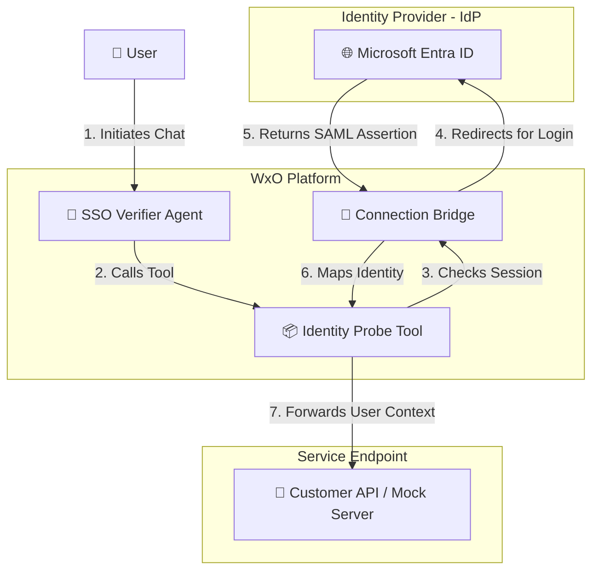

# SSO Guide: Microsoft Entra ID (SAML/SSO) Integration
**Author:** Markus van Kempen | mvk@ca.ibm.com  
[Research | Floor 7½ 🏢🤏](https://pages.github.ibm.com/mvankempen/homepage/)  
*No bug too small, no syntax too weird.*

---

## 🗺️ SSO Identity Flow
The following diagram illustrates how user identity is propagated from Microsoft Entra ID through Watsonx Orchestrate to your downstream tools:



---

## 📑 Program Index
This directory provides a structured methodology for verifying SSO integration.

| File | Role | Description |
| :--- | :--- | :--- |
| **[`ENTRA_ID_SETUP_GUIDE.md`](ENTRA_ID_SETUP_GUIDE.md)** | **📘 Setup Guide** | Complete guide for configuring Microsoft Entra ID with WatsonX SSO, including official documentation links and Entity ID/ACS URL discovery. |
| **[`run_sso_with_wxo_connection.sh`](run_sso_with_wxo_connection.sh)** | **🔗 Connection Tester** | Tests SSO with existing WxO connections (Box, Salesforce, etc.). No mock service needed! |
| **[`run_complete_test.sh`](run_complete_test.sh)** | **🚀 Automated Runner** | Fully automated test with mock service + ngrok. |
| **[`run_sso_e2e_test.sh`](run_sso_e2e_test.sh)** | **⚙️ Manual Runner** | Deploys SSO verification stack (requires ngrok URL). |
| **[`find_saml_endpoints.py`](find_saml_endpoints.py)**| **🔍 Diagnostic** | Discovers Entity ID and ACS URLs for your WxO tenant. |
| **[`mock_identity_service.py`](mock_identity_service.py)** | **🖥️ Mock Service** | Flask service that receives and logs SSO identity data. |
| [`sso_identity_probe.yaml`](sso_identity_probe.yaml)| **📦 Tool Spec** | OpenAPI 3.0 spec with SAML authentication. |
| [`sso_verifier_agent.yaml`](sso_verifier_agent.yaml)| **🤖 Agent** | Native agent for identity propagation testing. |
| [`QUICKSTART.md`](QUICKSTART.md) | **⚡ Quick Start** | Fast setup instructions. |
| [`TEST_SUMMARY.md`](TEST_SUMMARY.md) | **📊 Summary** | Complete test documentation and results. |
| [`CONNECTION_TEST_GUIDE.md`](CONNECTION_TEST_GUIDE.md) | **🔗 Connection Guide** | Guide for testing with WxO connections. |
| `README.md` | **📖 Main Docs** | This overview and architecture guide. |

---

## 🚀 Quick Start

### Option 1: Test with Existing WxO Connection (Easiest)

```bash
./run_sso_with_wxo_connection.sh
```

Select a connection (Box, Salesforce, etc.) and the script will test SSO automatically.

### Option 2: Complete Setup with Entra ID

**See the comprehensive guide:** [`ENTRA_ID_SETUP_GUIDE.md`](ENTRA_ID_SETUP_GUIDE.md)

Quick steps:
1. **Get SAML endpoints**: `python3 find_saml_endpoints.py`
2. **Configure Entra ID**: Follow [`ENTRA_ID_SETUP_GUIDE.md`](ENTRA_ID_SETUP_GUIDE.md)
3. **Run test**: `./run_complete_test.sh`

## 📚 Documentation Links

### WatsonX Orchestrate Official Docs
- [Configuring single sign-on](https://www.ibm.com/docs/en/watsonx/watson-orchestrate/current?topic=security-configuring-single-sign)
- [SAML 2.0 authentication](https://www.ibm.com/docs/en/watsonx/watson-orchestrate/current?topic=sign-saml-20-authentication)
- [Authenticating connections](https://www.ibm.com/docs/en/watsonx/watson-orchestrate/current?topic=connections-authenticating)

### Microsoft Entra ID Official Docs
- [Add an enterprise application](https://learn.microsoft.com/en-us/entra/identity/enterprise-apps/add-application-portal)
- [Configure SAML-based SSO](https://learn.microsoft.com/en-us/entra/identity/enterprise-apps/add-application-portal-setup-sso)

---

## 💾 Appendix: Your Tenant Parameters
Based on your current environment configuration:

| Field | Value |
| :--- | :--- |
| **Identifier (Entity ID)** | `https://api.dl.watson-orchestrate.ibm.com/instances/20260409-1024-1886-70e4-25304afe4a1b/saml/metadata` |
| **Reply URL (ACS URL)** | `https://api.dl.watson-orchestrate.ibm.com/instances/20260409-1024-1886-70e4-25304afe4a1b/saml/acs` |

---
